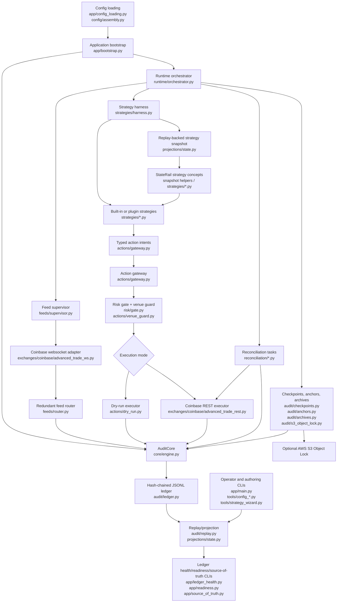

# System Diagram

This is the compact StateRail component map for contributors and operators. The ledger is the source of truth. Runtime services, strategy code, feeds, reconciliation, and tools extend audited boundaries instead of writing side channels.

## High-Level Flow

## Write Boundaries

- `AuditCore.append()` is the append boundary for runtime records.
- `ActionGateway.submit_and_execute()` is the only path for strategy/order intents.
- Strategies return typed intents. They must not call REST clients, websocket sources, ledger append APIs, or executors directly.
- Strategy authors should write against StateRail concepts. Venue adapters translate venue payloads into accepted ledger facts and replayed projection state.
- Reconciliation and smoke tools may call exchange clients, but their observations are recorded back to the ledger through the core.
- Read-only tools verify and replay the ledger; they do not mutate operator state unless the command explicitly records a compact qualification/preflight result.

## Replay Boundaries

- The projection in `projections/state.py` is the source-of-truth derived state.
- In-memory runtime state is cache only. Restart behavior must be reconstructable from replay.
- Ledger health, readiness, strategy simulation, and source-of-truth export use replayed state instead of private runtime state.

## Safety Boundaries

- Operator policy and `RiskGate` enforce order/risk constraints before execution.
- Live strategies require explicit strategy scheduling, live execution approval, clean ledger health, clean no-order preflight evidence, product metadata, and runtime gate approval.
- Strategy intent submission is ordered and fail-closed. If an action receipt is rejected or fails, later intents from that decision are not submitted and the current strategy cycle stops.
- Staged placements are not visible exchange orders. Release is a separate audited action that must pass the same gateway/risk/execution path.

## Extension Points

- Strategy packages can register through the `staterail.strategies` entry point group.
- Hooks can observe audited append lifecycle events, but hook failures are isolated and audited.
- Additional venues should be added behind the existing executor, product metadata, feed, readiness, and risk boundaries. Do not introduce a parallel order path.
